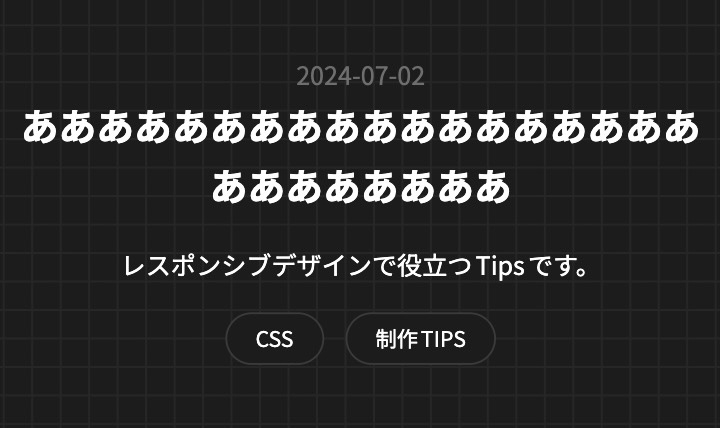
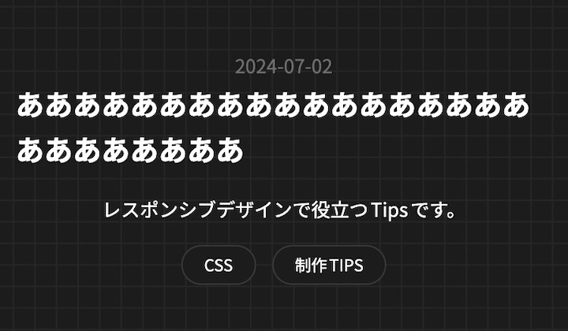

## `text-align`を使った中央寄せの問題
ビューポートが狭くなり折り返しが発生する場合、見た目的に不格好になってしまうことです。
そのため、メディアクエリで`text-align`を`left`に戻す指定が必要になる場合があります。
レスポンシブデザインでは、よくある状況だと思います。

<figure>
  
  <figcaption>`text-align: center;`での指定</figcaption>
</figure>

```css title="🙅‍♂️ Not Recommend"
.text {
  text-align: center;
}

@media (width <= 375px) {
  .text {
    text-align: left;
  }
}
```

## `fit-content`を知る
`fit-content`とは、最小寸法・最大寸法がコンテンツの寸法になる指定です。
`inline-block`の様に、対象の内容量に沿った寸法になります。

> `width`, `height`, `min-width`, `min-height`, `max-width`, `max-height` のレイアウトされたボックスの大きさとして使用される場合、最大寸法と最小寸法は、コンテンツの寸法を参照します。

https://developer.mozilla.org/ja/docs/Web/CSS/fit-content


## `fit-content`の何が良いのか
`text-align`での問題点を完全に解消することができます。
テキストの位置を変更していないので、不格好になることもありません。
文字の面一が揃って綺麗です。

<figure>
  
  <figcaption>`iline-size: fit-content;`での指定</figcaption>
</figure>

メディアクエリが無くなり、記述量も少なくなりました。
論理プロパティで記述していますが、通常のプロパティで書いても問題ありません。

```diff lang=css title="🙆‍♂️ Recommend"
- .text {
-  text-align: center;
- }
-
- @media (width <= 375px) {
-  .text {
-    text-align: left;
-  }
- }
+ .text {
+   inline-size: fit-content;
+   margin-inline: auto;
+ }
```

## おわりに
`fit-content`を使うと、レスポンシブデザインでよくある状況をスマートに解決することができます。
以上になります。
